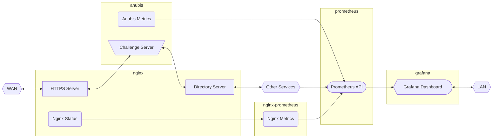

# esdmr’s configuration for reverse proxy and other tools at gateway



## Getting Started

1. Clone the repository.

   ```sh
   git clone https://github.com/esdmr/gateway.git
   cd gateway
   ```
2. Manually configure TLS `subjectAltName` (`tls/server/ext.cnf`) and Nginx `server_name` (`nginx/name.inc`).

   See [`dlink.update-name.sh`](dlink.update-name.sh) for an example.
3. Generate CA and server certificates.

   ```sh
	make tls
   ```
4. Download and build Anubis image. (You can also use `ghcr.io/techarohq/anubis` directly.)

   ```sh
   make anubis
   ```
5. Start server using Docker Compose.
   ```
   make up
   ```
